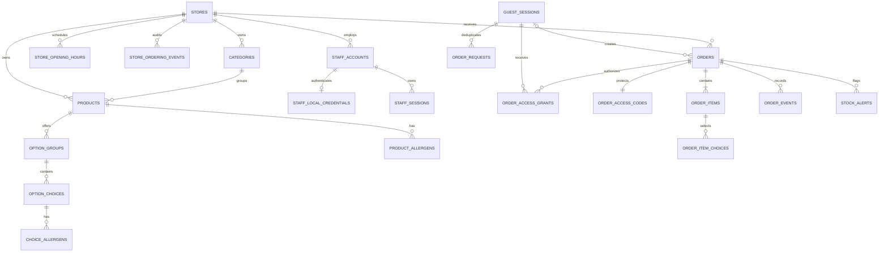

# モバイルオーダー データベース設計書

> **対象**: Phase1の架空検証と、実店舗初回利用を見据えた単一店舗・テイクアウト注文
> **DB基盤**: PostgreSQL（開発時はDocker、本番候補はマネージドPostgreSQL）
> **関連文書**: [要件定義書](01_要件定義書.md)、[詳細設計書](02_詳細設計書.md)、[検証計画](validation-plan.md)
> **資料区分**: 論理・物理設計。DDL実装、実店舗公開、実データ投入は未実施。

## 目次

1. [テーブル一覧](#テーブル一覧)
2. [共通仕様](#共通仕様)
3. [設計範囲と正規化方針](#設計範囲と正規化方針)
4. [店舗・商品系](#店舗商品系)
5. [スタッフ・匿名セッション系](#スタッフ匿名セッション系)
6. [注文・履歴系](#注文履歴系)
7. [注文状態と遷移](#注文状態と遷移)
8. [制約・索引・トランザクション](#制約索引トランザクション)
9. [保存・削除方針](#保存削除方針)
10. [権限・アクセス制御](#権限アクセス制御)
11. [将来拡張と実店舗移行条件](#将来拡張と実店舗移行条件)
12. [設計の検証条件](#設計の検証条件)

## テーブル一覧

| 領域                     | テーブル                  | 役割                               |
| ------------------------ | ------------------------- | ---------------------------------- |
| 店舗・商品               | `stores`                  | 店舗情報と注文受付設定             |
| 店舗・商品               | `store_opening_hours`     | 店舗の曜日別営業時間               |
| 店舗・商品               | `store_ordering_events`   | 注文受付の停止・再開履歴           |
| 店舗・商品               | `categories`              | 商品カテゴリ                       |
| 店舗・商品               | `products`                | 商品情報と販売状態                 |
| 店舗・商品               | `option_groups`           | 商品ごとのオプショングループ       |
| 店舗・商品               | `option_choices`          | オプショングループの選択肢         |
| 店舗・商品               | `allergens`               | アレルゲン定義                     |
| 店舗・商品               | `product_allergens`       | 商品に含まれるアレルゲン           |
| 店舗・商品               | `choice_allergens`        | 選択肢に含まれるアレルゲン         |
| スタッフ・匿名セッション | `staff_accounts`          | 店舗スタッフとロール               |
| スタッフ・匿名セッション | `staff_local_credentials` | スタッフのログイン認証情報         |
| スタッフ・匿名セッション | `staff_sessions`          | スタッフのログインセッション       |
| スタッフ・匿名セッション | `guest_sessions`          | 匿名注文者の一時セッション         |
| 注文・履歴               | `orders`                  | 注文の現在状態と合計               |
| 注文・履歴               | `order_items`             | 注文時点の商品明細                 |
| 注文・履歴               | `order_item_choices`      | 注文時点のオプション選択           |
| 注文・履歴               | `order_events`            | 状態・内容変更の追記履歴           |
| 注文・履歴               | `stock_alerts`            | 品切れ商品の注文別対応状況         |
| 注文・履歴               | `order_requests`          | 注文確定要求の冪等性               |
| 注文・履歴               | `order_access_codes`      | 注文照会コードのハッシュ           |
| 注文・履歴               | `order_access_grants`     | 匿名セッションごとの注文アクセス権 |

## 共通仕様

- 識別子はUUID、日時は`TIMESTAMPTZ`でUTC保存、金額は税込の非負`INTEGER`円、数量は正の`INTEGER`とする。文字数・金額・数量の上限はAPIとDBの両方で定める。
- 状態・ロール・イベント種別は`TEXT`と`CHECK`制約で定義する。状態追加時はマイグレーションと業務ルールを同時に変更する。`updated_at`は更新トランザクションで明示設定する。
- 外部キーは原則`ON DELETE RESTRICT`。注文集約の期限後削除に限り、注文明細・イベント・警告・照会コード・アクセス権・冪等要求を連動削除する。匿名セッション削除時は注文の作成元だけNULLにし、アクセス権と冪等要求を削除する。
- DB接続はサーバー側の業務サービスに限定する。注文合計、選択肢適合性、状態遷移、履歴の同時記録など複数表にまたがる規則は同一トランザクションで検査する。
- PostgreSQLの`CHECK`制約は他表や明細合計を参照できないため、外部キー・一意制約で表現できる不変条件はDBで、複数表にまたがる業務条件は業務サービスで保証する。[PostgreSQLの制約](https://www.postgresql.org/docs/current/ddl-constraints.html)

## 設計範囲と正規化方針

### 現行案の評価と改訂方針

| 観点           | 現行の詳細設計案                                                                     | この設計での改善                                                                                 |
| -------------- | ------------------------------------------------------------------------------------ | ------------------------------------------------------------------------------------------------ |
| 拡張性         | `store_id`、注文スナップショット、認証境界は有効                                     | 店舗をまたぐ外部キーを明示し、会員・決済・店内飲食は後から独立したテーブルで追加する             |
| 正規化         | 商品オプションはグループ化されているが、カテゴリ・アレルゲンと注文選択肢の定義が不足 | 管理データを関係テーブルに分け、注文時の表示値だけを意図的に複製する                             |
| 整合性         | 状態と履歴の同時更新方針は有効だが、一意制約・外部キー・ロック順が不足               | DB制約、注文version、同一トランザクション、品切れ警告の部分一意索引を定義する                    |
| 削除・運用     | 「論理削除」と「完了一覧から除外」の区別が曖昧                                       | 取消は状態、一覧からの除外は検索条件、商品廃止は論理削除、保持期限後の注文削除は物理削除と分ける |
| 実店舗への備え | 匿名Cookie喪失時の注文追跡、会計・通知・税の扱いは未確定                             | 将来拡張の接続点を示し、実店舗での利用開始前に決める事項を明記する                               |

現行のPhase1は架空注文のみを扱う。実店舗初回利用の目標構成は匿名注文・店頭支払いであり、アプリは会計記録・領収書を作らず、既存の店頭会計手段を使う。実際の注文を受ける前に、店舗情報、商品・価格、運用、データ保護を確認する。単一店舗でも店舗IDを持たせるのは、権限と参照の境界を確実にするためであり、Phase1で複数店舗を提供するためではない。過度な汎用化を避け、将来機能の空欄列や未使用テーブルは先に追加しない。

### 関係と正規化の原則

商品、カテゴリ、オプショングループ、選択肢、アレルゲンは管理時の正本として分離する。注文には商品名・選択肢名・価格・アレルゲン表示を確定時点のスナップショットとして保持する。この重複は、商品編集後も過去の注文を再現するための意図的な非正規化である。注文の現在明細は`order_items`と`order_item_choices`、過去の改訂は追記専用の`order_events`で表す。履歴JSONBを現在明細の正本や集計用テーブルとして使わない。

## 店舗・商品系

型にはPostgreSQLの型名を小文字で記載する。NULLとデフォルトは列ごとに示し、主キー・外部キー・一意制約などの制約は各テーブルの「制約・用途」に記載する。作成・更新日時は業務上必要なテーブルに設ける。

### `stores`

| カラム                 | 型           | NULL     | デフォルト | 説明                   |
| ---------------------- | ------------ | -------- | ---------- | ---------------------- |
| `id`                   | uuid         | NOT NULL | —          | 主キー                 |
| `name`                 | varchar(120) | NOT NULL | —          | 名称                   |
| `address_text`         | text         | NOT NULL | —          | 店舗住所               |
| `pickup_instruction`   | text         | NOT NULL | —          | 受取案内               |
| `accepting_orders`     | boolean      | NOT NULL | `false`    | 注文受付可否           |
| `order_cutoff_minutes` | integer      | NOT NULL | —          | 閉店前の注文締切（分） |

**制約・用途**: 全列必須。`accepting_orders`は初期値false、`CHECK(order_cutoff_minutes >= 0)`。実店舗初回利用前に受取場所と案内、閉店前の注文締切を設定

### `store_opening_hours`

| カラム      | 型       | NULL     | デフォルト | 説明               |
| ----------- | -------- | -------- | ---------- | ------------------ |
| `store_id`  | uuid     | NOT NULL | —          | 店舗ID             |
| `weekday`   | smallint | NOT NULL | —          | 曜日（0〜6）       |
| `opens_at`  | time     | NOT NULL | —          | 営業時間の開始時刻 |
| `closes_at` | time     | NOT NULL | —          | 営業時間の終了時刻 |

**制約・用途**: 全列必須。`store_id → stores.id`、複合主キー`(store_id, weekday, opens_at)`、`CHECK(weekday BETWEEN 0 AND 6)`、`opens_at < closes_at`。曜日はJavaScriptの`Date.getDay()`に合わせ、日曜を0、土曜を6とする。同日の複数営業時間帯を表現できる。

### `store_ordering_events`

| カラム           | 型          | NULL     | デフォルト | 説明                 |
| ---------------- | ----------- | -------- | ---------- | -------------------- |
| `id`             | uuid        | NOT NULL | —          | 主キー               |
| `store_id`       | uuid        | NOT NULL | —          | 店舗ID               |
| `actor_staff_id` | uuid        | NOT NULL | —          | 操作したスタッフID   |
| `from_accepting` | boolean     | NOT NULL | —          | 変更前の注文受付可否 |
| `to_accepting`   | boolean     | NOT NULL | —          | 変更後の注文受付可否 |
| `reason`         | text        | NULL     | —          | 対応理由             |
| `created_at`     | timestamptz | NOT NULL | —          | 作成日時             |

**制約・用途**: `reason`以外は必須。`(actor_staff_id, store_id) → staff_accounts(id, store_id)`、`CHECK(from_accepting <> to_accepting)`。受付の手動停止・再開を追記し、原因を調べられるようにする

### `categories`

| カラム       | 型          | NULL     | デフォルト | 説明     |
| ------------ | ----------- | -------- | ---------- | -------- |
| `id`         | uuid        | NOT NULL | —          | 主キー   |
| `store_id`   | uuid        | NOT NULL | —          | 店舗ID   |
| `name`       | varchar(80) | NOT NULL | —          | 名称     |
| `sort_order` | integer     | NOT NULL | —          | 表示順   |
| `retired_at` | timestamptz | NULL     | —          | 廃止日時 |

**制約・用途**: 前4列必須。`store_id → stores.id`。`UNIQUE(store_id, name)`、`UNIQUE(id, store_id)`。商品が参照中のカテゴリは物理削除しない

### `products`

| カラム         | 型           | NULL     | デフォルト | 説明               |
| -------------- | ------------ | -------- | ---------- | ------------------ |
| `id`           | uuid         | NOT NULL | —          | 主キー             |
| `store_id`     | uuid         | NOT NULL | —          | 店舗ID             |
| `category_id`  | uuid         | NOT NULL | —          | カテゴリID         |
| `name`         | varchar(120) | NOT NULL | —          | 名称               |
| `description`  | text         | NULL     | —          | 商品説明           |
| `image_ref`    | text         | NULL     | —          | 商品画像の参照     |
| `base_price`   | integer      | NOT NULL | —          | 税込基本価格（円） |
| `is_published` | boolean      | NOT NULL | —          | メニュー掲載可否   |
| `is_available` | boolean      | NOT NULL | —          | 販売可否           |
| `retired_at`   | timestamptz  | NULL     | —          | 廃止日時           |

**制約・用途**: `description`・`image_ref`・`retired_at`以外は必須。`(category_id, store_id) → categories(id, store_id)`、`UNIQUE(id, store_id)`、`CHECK(base_price >= 0)`。公開中かつ販売中かつ廃止前のみ新規選択可能

### `option_groups`

| カラム        | 型          | NULL     | デフォルト | 説明           |
| ------------- | ----------- | -------- | ---------- | -------------- |
| `id`          | uuid        | NOT NULL | —          | 主キー         |
| `product_id`  | uuid        | NOT NULL | —          | 商品ID         |
| `name`        | varchar(80) | NOT NULL | —          | 名称           |
| `is_required` | boolean     | NOT NULL | —          | 選択必須フラグ |
| `sort_order`  | integer     | NOT NULL | —          | 表示順         |
| `retired_at`  | timestamptz | NULL     | —          | 廃止日時       |

**制約・用途**: `retired_at`以外は必須。`product_id → products.id`、`UNIQUE(product_id, name)`、`UNIQUE(id, product_id)`。Phase1はグループ内で単一選択

### `option_choices`

| カラム             | 型          | NULL     | デフォルト | 説明                 |
| ------------------ | ----------- | -------- | ---------- | -------------------- |
| `id`               | uuid        | NOT NULL | —          | 主キー               |
| `group_id`         | uuid        | NOT NULL | —          | オプショングループID |
| `name`             | varchar(80) | NOT NULL | —          | 名称                 |
| `additional_price` | integer     | NOT NULL | —          | 追加料金（円）       |
| `sort_order`       | integer     | NOT NULL | —          | 表示順               |
| `retired_at`       | timestamptz | NULL     | —          | 廃止日時             |

**制約・用途**: `retired_at`以外は必須。`group_id → option_groups.id`、`UNIQUE(group_id, name)`、`UNIQUE(id, group_id)`、`CHECK(additional_price >= 0)`

### `allergens`

| カラム  | 型          | NULL     | デフォルト | 説明             |
| ------- | ----------- | -------- | ---------- | ---------------- |
| `id`    | uuid        | NOT NULL | —          | 主キー           |
| `code`  | varchar(40) | NOT NULL | —          | 一意の識別コード |
| `label` | varchar(80) | NOT NULL | —          | 表示名           |

**制約・用途**: 全列必須、`code`一意。架空の表示データをシード。実店舗の情報の正確性は別途確認

### `product_allergens`

| カラム        | 型   | NULL     | デフォルト | 説明         |
| ------------- | ---- | -------- | ---------- | ------------ |
| `product_id`  | uuid | NOT NULL | —          | 商品ID       |
| `allergen_id` | uuid | NOT NULL | —          | アレルゲンID |

**制約・用途**: 複合主キー。基礎部分に含まれるアレルゲン。各列は対応する親へ外部キー

### `choice_allergens`

| カラム        | 型   | NULL     | デフォルト | 説明         |
| ------------- | ---- | -------- | ---------- | ------------ |
| `choice_id`   | uuid | NOT NULL | —          | 選択肢ID     |
| `allergen_id` | uuid | NOT NULL | —          | アレルゲンID |

**制約・用途**: 複合主キー。選択肢由来のアレルゲン。各列は対応する親へ外部キー

`product_allergens`はどの選択肢でも変わらない材料だけに使う。材料を置き換える場合は必須の単一選択グループを作り、標準選択肢を含む全選択肢のアレルゲンを`choice_allergens`へ登録する。選択内容に応じて不変部分と選択肢の和集合を表示する。実店舗利用前には店舗が原材料・交差接触・変更時の確認手順を確認する。「オプション変更はアレルギー対応を保証しない」という注意も維持する。架空データを安全保証として扱わない。

注文確定時は現在時刻を店舗のタイムゾーンへ変換して現地の曜日・時刻を求め、営業時間を判定する。曜日番号は日曜を0、土曜を6とし、JavaScriptの`Date.getDay()`およびPostgreSQLの`EXTRACT(DOW FROM ...)`と対応させる。`accepting_orders=true`かつ該当営業時間帯の終了から`order_cutoff_minutes`を引いた時刻までの場合だけ受け付ける。定休日は営業時間帯を登録しない。臨時休業・混雑時は管理者またはホールが受付可否を手動で切り替え、`store_ordering_events`を同じトランザクションで記録する。営業時間と注文受付可否は客のメニュー画面にも表示する。営業時間の変更手順、注文締切、臨時休業時の担当は初回利用前に店舗と確認する。

## スタッフ・匿名セッション系

### `staff_accounts`

| カラム        | 型          | NULL     | デフォルト | 説明               |
| ------------- | ----------- | -------- | ---------- | ------------------ |
| `id`          | uuid        | NOT NULL | —          | 主キー             |
| `store_id`    | uuid        | NOT NULL | —          | 店舗ID             |
| `role`        | text        | NOT NULL | —          | スタッフロール     |
| `disabled_at` | timestamptz | NULL     | —          | アカウント停止日時 |

**制約・用途**: `disabled_at`以外は必須。`store_id → stores.id`、`UNIQUE(id, store_id)`、`CHECK(role IN ('hall','kitchen','admin'))`。廃止時は停止し、注文履歴が参照中は物理削除しない

### `staff_local_credentials`

| カラム          | 型           | NULL     | デフォルト | 説明               |
| --------------- | ------------ | -------- | ---------- | ------------------ |
| `staff_id`      | uuid         | NOT NULL | —          | スタッフID         |
| `login_id`      | varchar(120) | NOT NULL | —          | ログインID         |
| `password_hash` | text         | NOT NULL | —          | パスワードハッシュ |
| `updated_at`    | timestamptz  | NOT NULL | —          | 更新日時           |

**制約・用途**: 全列必須。`staff_id`主キーで`staff_accounts.id`を参照、`login_id`一意。平文パスワードを保存しない

### `staff_sessions`

| カラム       | 型          | NULL     | デフォルト | 説明                             |
| ------------ | ----------- | -------- | ---------- | -------------------------------- |
| `token_hash` | bytea       | NOT NULL | —          | 認証トークンのハッシュ（主キー） |
| `staff_id`   | uuid        | NOT NULL | —          | スタッフID                       |
| `expires_at` | timestamptz | NOT NULL | —          | 有効期限                         |
| `revoked_at` | timestamptz | NULL     | —          | 失効日時                         |
| `created_at` | timestamptz | NOT NULL | —          | 作成日時                         |

**制約・用途**: `revoked_at`以外は必須。`token_hash`主キー、`staff_id → staff_accounts.id`。平文トークンをDBに保存しない

### `guest_sessions`

| カラム       | 型          | NULL     | デフォルト | 説明                             |
| ------------ | ----------- | -------- | ---------- | -------------------------------- |
| `id`         | uuid        | NOT NULL | —          | 主キー                           |
| `token_hash` | bytea       | NOT NULL | —          | 認証トークンのハッシュ（主キー） |
| `expires_at` | timestamptz | NOT NULL | —          | 有効期限                         |
| `created_at` | timestamptz | NOT NULL | —          | 作成日時                         |

**制約・用途**: 全列必須。`token_hash`一意。個人情報を持たない一時的な端末セッション

匿名セッションは認証済み会員ではない。注文の取得・更新時はCookieのトークンハッシュを照合し、有効なセッションと有効な`order_access_grants`の組み合わせを確認する。期限切れのセッションは注文とは別に削除できる。スタッフのパスワードハッシュ方式、セッション期限、再ログイン運用は認証実装時に決め、DBには方式変更を許すハッシュ文字列を保存する。将来Supabase Auth等へ切り替える際は、外部主体IDと`staff_accounts.id`を結ぶ認証IDテーブルを追加し、ロール・注文履歴側の参照を変えない。既存パスワードの移行方法とセッションの再発行は別途設計する。

## 注文・履歴系

### 注文の現在状態

### `orders`

| カラム                        | 型          | NULL     | デフォルト | 説明                           |
| ----------------------------- | ----------- | -------- | ---------- | ------------------------------ |
| `id`                          | uuid        | NOT NULL | —          | 主キー                         |
| `store_id`                    | uuid        | NOT NULL | —          | 店舗ID                         |
| `created_by_guest_session_id` | uuid        | NULL     | —          | 注文を作成した匿名セッションID |
| `order_number`                | varchar(32) | NOT NULL | —          | 店舗内の受付番号               |
| `status`                      | text        | NOT NULL | —          | 注文状態                       |
| `version`                     | bigint      | NOT NULL | —          | 注文の更新バージョン           |
| `total_price`                 | integer     | NOT NULL | —          | 注文合計（税込・円）           |
| `created_at`                  | timestamptz | NOT NULL | —          | 作成日時                       |
| `updated_at`                  | timestamptz | NOT NULL | —          | 更新日時                       |
| `accepted_at`                 | timestamptz | NULL     | —          | 受理日時                       |
| `ready_at`                    | timestamptz | NULL     | —          | 受取待ちになった日時           |
| `completed_at`                | timestamptz | NULL     | —          | 提供済みまたは取消になった日時 |

**制約・用途**: 作成元セッション・受理時刻・受取待ち時刻・完了時刻は任意、他は必須。`store_id → stores.id`、作成元セッションは`guest_sessions.id ON DELETE SET NULL`、`UNIQUE(store_id, order_number)`、`UNIQUE(id, store_id)`、`CHECK(version >= 1)`、`CHECK(total_price >= 0)`、`CHECK(status IN ('received','reviewing','preparing','ready','served','canceled'))`。番号は表示用で認証には使わない

### `order_items`

| カラム               | 型           | NULL     | デフォルト | 説明                     |
| -------------------- | ------------ | -------- | ---------- | ------------------------ |
| `id`                 | uuid         | NOT NULL | —          | 主キー                   |
| `order_id`           | uuid         | NOT NULL | —          | 注文ID                   |
| `store_id`           | uuid         | NOT NULL | —          | 店舗ID                   |
| `product_id`         | uuid         | NOT NULL | —          | 商品ID                   |
| `product_name`       | varchar(120) | NOT NULL | —          | 注文時点の商品名         |
| `base_unit_price`    | integer      | NOT NULL | —          | 注文時点の基本単価（円） |
| `unit_price`         | integer      | NOT NULL | —          | 注文時点の単価（円）     |
| `quantity`           | integer      | NOT NULL | —          | 注文数量                 |
| `line_total`         | integer      | NOT NULL | —          | 注文明細の小計（円）     |
| `allergen_statement` | text         | NOT NULL | —          | 注文時点のアレルゲン表示 |
| `sort_order`         | integer      | NOT NULL | —          | 表示順                   |

**制約・用途**: 全列必須。`(order_id, store_id) → orders(id, store_id) ON DELETE CASCADE`、`(product_id, store_id) → products(id, store_id)`、`UNIQUE(id, product_id)`。価格非負、数量は1以上。商品名と表示文は注文時点の複製

### `order_item_choices`

| カラム             | 型          | NULL     | デフォルト | 説明                           |
| ------------------ | ----------- | -------- | ---------- | ------------------------------ |
| `id`               | uuid        | NOT NULL | —          | 主キー                         |
| `order_item_id`    | uuid        | NOT NULL | —          | 注文明細ID                     |
| `product_id`       | uuid        | NOT NULL | —          | 商品ID                         |
| `group_id`         | uuid        | NOT NULL | —          | オプショングループID           |
| `choice_id`        | uuid        | NOT NULL | —          | 選択肢ID                       |
| `group_name`       | varchar(80) | NOT NULL | —          | 注文時点のオプショングループ名 |
| `choice_name`      | varchar(80) | NOT NULL | —          | 注文時点の選択肢名             |
| `additional_price` | integer     | NOT NULL | —          | 追加料金（円）                 |

**制約・用途**: 全列必須。`(order_item_id, product_id) → order_items(id, product_id) ON DELETE CASCADE`、`(group_id, product_id) → option_groups(id, product_id)`、`(choice_id, group_id) → option_choices(id, group_id)`、`UNIQUE(order_item_id, group_id)`、`CHECK(additional_price >= 0)`。選択肢名・価格は注文時点の複製

`unit_price = base_unit_price + SUM(order_item_choices.additional_price)`、`line_total = unit_price × quantity`、`orders.total_price = SUM(order_items.line_total)`をトランザクション中にサーバーが計算・検査する。DB列の数値範囲を超える注文は拒否する。商品価格・名称や選択肢を後から変更しても、既存の注文スナップショットと金額を更新しない。注文修正時は現在明細を同一トランザクションで入れ替え、変更前後を`order_events`へ記録する。

廃止済みのオプショングループ・選択肢は新規注文や修正で選べないが、既存注文のスナップショットと参照先は保持する。`completed_at`は`served`または`canceled`へ移った時刻であり、状態変更と同じトランザクションで設定する。

### 履歴、品切れ、重複防止

### `order_events`

| カラム                   | 型          | NULL     | デフォルト | 説明                         |
| ------------------------ | ----------- | -------- | ---------- | ---------------------------- |
| `id`                     | uuid        | NOT NULL | —          | 主キー                       |
| `order_id`               | uuid        | NOT NULL | —          | 注文ID                       |
| `store_id`               | uuid        | NOT NULL | —          | 店舗ID                       |
| `version`                | bigint      | NOT NULL | —          | 注文の更新バージョン         |
| `ordinal`                | integer     | NOT NULL | —          | 同一version内のイベント順    |
| `event_type`             | text        | NOT NULL | —          | イベント種別                 |
| `actor_role`             | text        | NOT NULL | —          | 操作主体のロール             |
| `actor_staff_id`         | uuid        | NULL     | —          | 操作したスタッフID           |
| `actor_guest_session_id` | uuid        | NULL     | —          | 操作時の匿名セッションID     |
| `from_status`            | text        | NULL     | —          | 変更前の注文状態             |
| `to_status`              | text        | NULL     | —          | 変更後の注文状態             |
| `before_snapshot`        | jsonb       | NULL     | —          | 変更前の注文スナップショット |
| `after_snapshot`         | jsonb       | NULL     | —          | 変更後の注文スナップショット |
| `reason`                 | text        | NULL     | —          | 対応理由                     |
| `created_at`             | timestamptz | NOT NULL | —          | 作成日時                     |

**制約・用途**: 両actor参照・状態・スナップショット・理由はイベントにより任意。`(order_id, store_id) → orders(id, store_id) ON DELETE CASCADE`、スタッフは同店舗を参照、ゲストセッションは削除時NULL、`UNIQUE(order_id, version, ordinal)`。追記のみで更新・個別削除しない

### `stock_alerts`

| カラム                 | 型          | NULL     | デフォルト | 説明                 |
| ---------------------- | ----------- | -------- | ---------- | -------------------- |
| `id`                   | uuid        | NOT NULL | —          | 主キー               |
| `order_id`             | uuid        | NOT NULL | —          | 注文ID               |
| `store_id`             | uuid        | NOT NULL | —          | 店舗ID               |
| `product_id`           | uuid        | NOT NULL | —          | 商品ID               |
| `opened_at`            | timestamptz | NOT NULL | —          | 警告の発生日時       |
| `resolved_at`          | timestamptz | NULL     | —          | 警告の解決日時       |
| `resolution`           | text        | NULL     | —          | 品切れ警告の解決方法 |
| `reason`               | text        | NULL     | —          | 対応理由             |
| `resolved_by_staff_id` | uuid        | NULL     | —          | 解決したスタッフID   |

**制約・用途**: 解決関連列は任意。`(order_id, store_id) → orders(id, store_id) ON DELETE CASCADE`、`(product_id, store_id) → products(id, store_id)`、解決担当者は同店舗のスタッフを参照。`CHECK`で未解決時は解決関連列が全てNULL、解決済み時は`resolved_at`・`resolution`・`reason`が揃うことを保証。`resolution`は`manual_confirmed`/`item_removed`/`order_canceled`/`restocked`、`UNIQUE(order_id, product_id) WHERE resolved_at IS NULL`の部分一意索引

### `order_requests`

| カラム             | 型          | NULL     | デフォルト | 説明               |
| ------------------ | ----------- | -------- | ---------- | ------------------ |
| `guest_session_id` | uuid        | NOT NULL | —          | 匿名セッションID   |
| `idempotency_key`  | uuid        | NOT NULL | —          | 冪等キー           |
| `request_hash`     | bytea       | NOT NULL | —          | 要求内容のハッシュ |
| `order_id`         | uuid        | NOT NULL | —          | 注文ID             |
| `created_at`       | timestamptz | NOT NULL | —          | 作成日時           |

**制約・用途**: 全列必須。複合主キー`(guest_session_id, idempotency_key)`、ゲストセッション削除時は連動削除、`(order_id, guest_session_id) → order_access_grants(order_id, guest_session_id) ON DELETE CASCADE`。同じキーと同じ入力なら既存注文を返す

### `order_access_codes`

| カラム      | 型          | NULL     | デフォルト | 説明                 |
| ----------- | ----------- | -------- | ---------- | -------------------- |
| `order_id`  | uuid        | NOT NULL | —          | 注文ID               |
| `code_hash` | bytea       | NOT NULL | —          | 照会コードのハッシュ |
| `issued_at` | timestamptz | NOT NULL | —          | 照会コードの発行日時 |

**制約・用途**: 全列必須。`order_id`主キー、`orders.id ON DELETE CASCADE`、`code_hash`一意。再発行時はハッシュと発行時刻を更新し、平文コードを保存しない

### `order_access_grants`

| カラム             | 型          | NULL     | デフォルト | 説明             |
| ------------------ | ----------- | -------- | ---------- | ---------------- |
| `order_id`         | uuid        | NOT NULL | —          | 注文ID           |
| `guest_session_id` | uuid        | NOT NULL | —          | 匿名セッションID |
| `created_at`       | timestamptz | NOT NULL | —          | 作成日時         |
| `revoked_at`       | timestamptz | NULL     | —          | 失効日時         |

**制約・用途**: `revoked_at`のみ任意。複合主キー`(order_id, guest_session_id)`、注文とセッションへの外部キーはいずれも`ON DELETE CASCADE`。コード照合後に新しい端末セッションへ権限を付与できる

イベント種別は`created`、`reviewed`、`amended`、`accepted`、`ready`、`served`、`canceled`、`stock_alert_opened`、`stock_alert_resolved`に`CHECK`で限定する。実行時はスタッフかゲストセッションの該当する主体IDを記録し、セッション削除後もロールと変更内容を残す。業務上の操作1回につき注文versionを1増やし、そのversionに対応するイベントを1件以上、同じトランザクションで挿入する。`ordinal`は同一version内の順番。スナップショットJSONBには注文の明細・金額・状態など再現に必要な値だけを保存し、セッショントークンやパスワード、将来の連絡先を入れない。JSONBの形はイベント種別ごとにアプリで検証し、マイグレーション時に版管理する。

ゲストセッションと冪等キーは注文送信前にブラウザへ保存しておく。注文確定時に推測困難な照会コードを一度だけ表示する。客は受付番号と照会コードを保存し、Cookieを失った場合に両方を入力して新しいゲストセッションへ注文アクセス権を付与できる。コードは少なくとも96ビットの暗号学的乱数で生成し、DBにはハッシュのみを保存する。入力回数を制限し、照合は一定時間比較とする。コードをURL、アクセスログ、解析ツールへ含めない。確定応答が失われても元のゲストセッションが有効なら、アクセス権から注文を再取得して照会コードを再発行できる。再発行時は旧コードのハッシュを無効にする。コードを失い、Cookieも使えない場合は、受付番号だけで注文を復旧できない。ホールは受付番号で注文状態を調べられるが、コードを表示・再発行するには別途本人確認手順を定めるまでは対応しない。

## 注文状態と遷移

| 状態        | 日本語   | 更新主体・次の状態                                             |
| ----------- | -------- | -------------------------------------------------------------- |
| `received`  | 受付済   | ホール確認で`reviewing`。客修正・取消も可能                    |
| `reviewing` | 確認中   | ホール受理で`preparing`。客修正では`received`へ戻る            |
| `preparing` | 調理中   | 厨房の調理完了で`ready`                                        |
| `ready`     | 受取待ち | ホールが店頭での会計・受け渡しを確認して`served`               |
| `served`    | 提供済み | 終端状態                                                       |
| `canceled`  | 取消     | 終端状態。客は受理前、ホールは未完了の注文を理由付きで取消可能 |

客の注文修正・取消は`received`または`reviewing`だけ。品切れ警告が未解決なら受理・受取待ち・提供済みへの進行を拒否する。調理完了と受け渡しを分離することで、厨房が実際の受け渡しを確認できない問題を避ける。会計の結果や金銭情報は本DBの状態に含めず、ホールが既存の店頭会計手段で確認してから`served`へ進める。

## 制約・索引・トランザクション

- 受付番号は`UNIQUE(store_id, order_number)`で衝突を最終防止し、採番し直す。推測可能な短い番号だけで客の注文を取得させない。注文確定時には受付可否と営業時間を店舗行ロックの下で再確認し、受付停止や営業時間変更との競合を直列化する。営業時間を変更する管理操作も店舗行を先にロックする。
- 商品・カテゴリ・スタッフ・注文は`store_id`を持つ。上記の複合外部キーで商品と注文、カテゴリと商品を同じ店舗に限定する。スタッフが他店舗の注文を操作できないことは、毎回のサーバー認可で検査する。
- 注文作成では店舗行の後に対象商品行をID順にロックして販売可否・価格・選択肢を判定する。客の修正では対象商品行をID順にロックし、その後に注文行をロックしてversionと状態を再検査する。管理者が商品・オプション価格・選択肢・アレルゲンを編集する際も、先に親の商品行をロックする。売切れ切替では商品行の後に影響注文をID順に処理し、未完了注文（`received`/`reviewing`/`preparing`/`ready`）の警告とイベントを記録する。ロック順を揃え、メニュー編集直後の古い価格の注文や品切れの取りこぼしを抑える。競合が起きた場合はトランザクションを再試行または409で通知する。[PostgreSQLの行ロック](https://www.postgresql.org/docs/current/explicit-locking.html)
- 客の修正後は状態を`received`に戻し、ホールの再確認を必要とする。取消は`canceled`への状態変更であり、注文行や履歴を削除しない。注文と明細、イベント、品切れ警告の変更は必ず同じトランザクションで確定する。
- `orders(store_id, status, created_at)`、`orders(created_by_guest_session_id, created_at)`、`orders(store_id, accepted_at) WHERE status = 'preparing'`、`orders(store_id, ready_at) WHERE status = 'ready'`、`order_events(order_id, version, ordinal)`、`stock_alerts(order_id) WHERE resolved_at IS NULL`、`products(store_id, category_id, is_published, is_available)`に索引を設ける。参照側外部キーの索引は実際の検索・削除計画で確認し、不要な索引は増やさない。
- 価格、必須グループの選択数、注文とイベントの一致、未解決警告がないことは複数表にまたがるため業務サービスが検査する。管理用SQLが業務規則を迂回しないよう、通常アプリのDB権限を限定する。

## 保存・削除方針

| データ                               | 通常の操作                                                                                             | 物理削除条件                                                                     |
| ------------------------------------ | ------------------------------------------------------------------------------------------------------ | -------------------------------------------------------------------------------- |
| 商品・カテゴリ・オプション           | 販売停止は`is_available=false`、掲載停止は`is_published=false`、廃止は`retired_at`を設定               | 参照中の注文・設定がなく、保守作業として削除する場合のみ                         |
| 注文                                 | 取消は状態`canceled`、提供済みは一覧の検索対象から外す。別の`deleted_at`やアーカイブテーブルを設けない | 保持方針確定後、完了・取消済みで期限を過ぎた注文集約を保守処理で削除             |
| 注文明細・イベント・品切れ警告       | 注文と同期間保持。イベントは追記のみ                                                                   | 親注文の期限後削除に連動。個別削除は禁止                                         |
| 匿名セッション・アクセス権・冪等要求 | 有効期限後に失効。注文の作成元参照はNULLにして保持。アクセス権と冪等要求はセッションに連動             | 期限後に削除。照会コードは注文と同期間保持                                       |
| スタッフアカウント                   | 退職・役割変更時は停止し、セッションを失効                                                             | 関連する注文イベントと店舗の受付切替履歴の保持が終わった後、別途決めた運用で削除 |
| 店舗の受付切替履歴                   | `store_ordering_events`を追記し、注文受付の停止理由を追跡                                              | 店舗の運用監査期間を決めた後に保守処理で削除                                     |

要件定義書6.3の「取消は状態で保持し、提供済みは一覧から除外する」と整合させる。Phase1では期間の確定まで自動削除しない。実店舗初回利用では、会計・問い合わせ・データ保護の要件を踏まえて保持期間と削除例外を決定し、バックアップからの復旧時に削除済みデータが再出現しない運用も決める。法定期間を本書で推定しない。

## 権限・アクセス制御

### アプリケーションロール

認証・認可はNext.jsのサーバー側業務サービスで行い、画面の表示制御だけに依存しない。スタッフは`staff_accounts.role`と有効な`staff_sessions`を照合し、操作対象の`store_id`も毎回検証する。客はセッショントークンのハッシュ、有効期限、注文単位の`order_access_grants`でアクセスを判定する。

| 主体     | 読取範囲                                           | 更新範囲                                                           |
| -------- | -------------------------------------------------- | ------------------------------------------------------------------ |
| 匿名の客 | 公開メニューと自身が権限を持つ注文                 | 注文作成、自身の受理前注文の修正・取消                             |
| ホール   | 同一店舗の注文・変更履歴・品切れ警告               | 内容確認、受理、理由付き取消、警告対応、提供済み更新、受付可否切替 |
| 厨房     | 同一店舗の調理対象注文と調理に必要な変更・取消通知 | 調理中から受取待ちへの更新                                         |
| 管理者   | 同一店舗の商品・オプション・アレルゲン、受付設定   | 商品情報・販売可否・受付可否の管理                                 |
| 保守処理 | 削除期限を満たすデータと運用上必要な記録           | 保持方針に基づく注文集約・期限切れセッション等の削除               |

### PostgreSQLの行レベルセキュリティ

Phase1はNext.jsサーバーからPostgreSQLへ接続し、アプリケーション層で認証・認可する。ブラウザからDBへ直接接続せず、Supabase等のクライアントロールを使わないため、RLSポリシーは設けない。将来、ブラウザや複数サービスがDBへ直接接続する構成へ変える場合は、接続主体ごとのDBロール、RLS、`FORCE ROW LEVEL SECURITY`の要否、ポリシー、所有者権限を別途設計し、ロール別・他店舗・他注文の拒否を検証する。

DB資格情報はサーバー環境にのみ置く。通常アプリ用DBロールにはスキーマ変更・任意DDL・保守削除権限を与えず、マイグレーション用・通常アプリ用・保守用の接続権限を分離する。パスワードハッシュとセッショントークンハッシュは必要な認証サービスだけが読み書きし、通常の注文取得応答やログへ含めない。具体的なGRANT文はDB接続ライブラリとマイグレーション方式の選定時に定義する。

## 将来拡張と実店舗移行条件

| 将来機能       | 追加時のDB変更                                                                                                                                                             | Phase1で作らない理由                           |
| -------------- | -------------------------------------------------------------------------------------------------------------------------------------------------------------------------- | ---------------------------------------------- |
| 会員・注文履歴 | 会員IDを認証基盤と切り離した主体として追加し、注文との関連を別テーブルで管理。既存匿名注文の紐付けは本人確認方法を決めてから行う                                           | 受付番号やCookieだけでは本人確認できない       |
| Stripe決済     | 注文とは別に決済試行、外部決済ID、Webhookイベント、返金履歴を追加。注文状態と支払状態を分離する                                                                            | 決済・返金はPhase1対象外                       |
| 店内飲食       | 受取方法、卓・セッションを別テーブルまたは専用列で追加し、既存注文はテイクアウトとして移行                                                                                 | 未使用のNULL列を先に増やさない                 |
| 複数店舗       | 店舗ごとの受付番号・商品・スタッフ権限を維持し、店舗選択と運営者の横断権限を追加                                                                                           | Phase1は単一店舗                               |
| 税・会計       | 初回利用では既存の店頭会計手段を正本とし、アプリの注文価格と店頭会計の突合手順を定義。将来アプリが会計を担う場合に、課税区分・税率・税額のスナップショットと会計記録を追加 | アプリは初回利用でも決済・領収書発行を行わない |

実店舗で使う前に、少なくとも受理後の品切れ連絡、受け渡しと`served`更新の責任、アレルゲン表示の正確性、店頭会計との突合、データ保持、バックアップ復元を確定する。税率を固定値で設計せず、制度変更と商品の区分を店頭会計側で扱う。テイクアウトと店内飲食では扱いが変わり得るため、アプリで会計処理を追加する時点で国税庁の最新案内を確認する。[国税庁の軽減税率案内](https://www.nta.go.jp/taxes/shiraberu/taxanswer/shohi/6102.htm) 公開する場合のDBは開発用DockerからマネージドPostgreSQLへ移せるよう、DDLとマイグレーションをPostgreSQL標準機能中心に保つ。

## 設計の検証条件

- S1: 同じ受付番号の注文について、現在明細、税込合計、`received`→`reviewing`→`preparing`→`ready`→`served`のイベント、各ロールの表示が一致する。
- S2・S3: 受理前の修正・取消だけが成功し、修正後の再確認、取消後の操作拒否、変更前後の履歴が確認できる。
- S4: 売切れと注文確定の競合でも、販売停止後の新規注文が成立せず、既存の未完了注文に警告が過不足なく残る。
- S5: 同一注文への同時操作で一方が成功し、他方は最新versionを取得するまで更新できない。金額とイベントに欠落・二重登録がない。
- S6: Cookie喪失後に受付番号と正しい秘密コードで新セッションへアクセス権を付与できる。誤コード・番号だけ・失効コードでは取得できず、試行回数制限が働く。
- 削除: 商品・スタッフの参照中削除は制約で拒否され、注文保持中に履歴が消えない。匿名セッション期限後も注文とイベントが残り、客のアクセス権だけが失効する。

今回追加した`ready`（受取待ち）は、[要件定義書](01_要件定義書.md)と[検証計画](validation-plan.md)にも反映した。この文書は設計の期待値であり、マイグレーションSQLや結合テストの実行結果ではない。実装後の確認結果は検証計画へ記録する。
